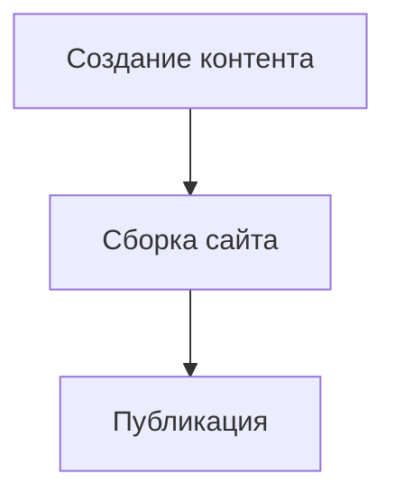

# StaticFlow


StaticFlow — это современный фреймворк для генерации быстрых, безопасных и легко поддерживаемых сайтов. Он сочетает в себе лучшие идеи из мира статических генераторов, CMS и веб-фреймворков, чтобы сделать процесс разработки и публикации сайтов максимально простым и гибким.

## 🎯 Что такое StaticFlow

### ⚡ StaticFlow — это про статику
StaticFlow генерирует полностью статические HTML-файлы, которые можно разместить на любом хостинге или CDN (например, GitHub Pages, Netlify, Vercel, Amazon S3 и др.). Это значит:

- 🚀 Нет необходимости в сервере или базе данных
- ⚡ Максимальная скорость загрузки страниц
- 🔒 Высокая безопасность (нет уязвимостей серверного кода)
- 📈 Простота масштабирования и резервного копирования

### 📝 StaticFlow — это про CMS
StaticFlow предоставляет удобный способ управления контентом через Markdown. Вы можете:

- 🏗️ Разделять структуру сайта и содержимое
- 🎨 Использовать шаблоны для автоматизации оформления
- ✏️ Делать правки без знания программирования
- 🔌 Интегрировать редакторы и плагины для расширения возможностей

### 🛠️ StaticFlow — это фреймворк
StaticFlow — не просто генератор, а полноценный фреймворк для моделирования структуры сайта:

- 🎨 Гибкая система шаблонов (Jinja2)
- 📊 Поддержка пользовательских моделей данных
- 🔌 Расширяемость через плагины и темы
- 🔗 Возможность интеграции с внешними сервисами и API

## 🚀 Быстрый старт

### ⚙️ Установка

```bash
pip install staticflow-framework
```

### 🏗️ Создание нового проекта

```bash
staticflow create my-awesome-site
cd my-awesome-site
```

Мастер создания проекта позволяет настроить:
- 🏷️ Название сайта
- 📝 Описание и автора
- 🌍 Основной язык сайта (автоматически определяется по IP или локали)
- 🌐 Добавление поддержки нескольких языков (многоязычность)

### 🚀 Запуск сервера разработки

```bash
staticflow serve
```

Откройте браузер по адресу `http://localhost:8000` для просмотра сайта и `http://localhost:8000/admin` для доступа к админ-панели.

## 📁 Структура проекта

```
my-awesome-site/
├── content/            # Ваш контент (Markdown, HTML)
├── templates/          # Шаблоны Jinja2
├── static/             # Статические файлы (CSS, JS, изображения)
├── output/             # Сгенерированный сайт
└── config.toml         # Конфигурация проекта
```

## 📝 Создание контента

### 🧱 Через блочный редактор

1. Откройте админ-панель (`http://localhost:8000/admin`)
2. Перейдите на вкладку "Block Editor"
3. Создавайте контент с помощью различных типов блоков:
   - 📋 Форматированный текст
   - 💻 Код с подсветкой синтаксиса
   - 📐 Математические формулы (LaTeX)
   - 📊 Диаграммы (Mermaid)
   - 📊 Таблицы
   - 🖼️ Медиа-файлы

### 📄 Через Markdown файлы

```markdown
---
title: Мой первый пост
date: 2023-03-23
tags: [tutorial, staticflow]
---

# Добро пожаловать

Это мой первый пост с использованием **StaticFlow**.

## Код с подсветкой

```python
def hello_world():
    print("Привет, StaticFlow!")
```

## Диаграммы


```

## ⚙️ Настройка

### Конфигурация (config.toml)

```toml
# Основные настройки
title = "Мой сайт на StaticFlow"
description = "Персональный сайт, созданный с помощью StaticFlow"
base_url = "https://example.com"
language = "ru"

# Настройки сборки
[build]
output_dir = "output"
source_dir = "content"
template_dir = "templates"
static_dir = "static"

# Настройки многоязычности
[languages]
default = "ru"
enabled = ["ru", "en"]
USE_LANGUAGE_PREFIXES = true
EXCLUDE_DEFAULT_LANG_PREFIX = true

# Плагины
[plugins]
enabled = ["seo", "sitemap", "rss", "minifier"]

[plugins.seo]
twitter_card = true
open_graph = true

[plugins.sitemap]
priority = 0.8
changefreq = "weekly"
```

### 🌐 Многоязычность

StaticFlow поддерживает многоязычные сайты с помощью языковых префиксов URL и языковых директорий.

#### Организация контента в языковых директориях

```
content/
├── ru/              # Контент на русском
│   ├── about.md
│   └── index.md
└── en/              # Контент на английском
    ├── about.md
    └── index.md
```

#### Настройка маршрутизации

В `config.toml` вы можете настроить параметры маршрутизации для многоязычного сайта:

```toml
[languages]
default = "ru"        # Язык по умолчанию
enabled = ["ru", "en"] # Поддерживаемые языки

# Использовать языковые префиксы в URL (/en/about.html)
USE_LANGUAGE_PREFIXES = true

# Язык по умолчанию без префикса (/about.html вместо /ru/about.html)
EXCLUDE_DEFAULT_LANG_PREFIX = true
```

## 🔌 Система плагинов

StaticFlow имеет мощную систему плагинов, которая позволяет:

### 🔧 Встроенные плагины

- **SEO** - автоматическая генерация мета-тегов, Open Graph, Twitter Cards
- **Sitemap** - создание XML карты сайта
- **RSS** - генерация RSS-лент
- **Minifier** - минификация CSS, JS и HTML
- **Syntax Highlight** - подсветка синтаксиса кода
- **Math** - поддержка математических формул (LaTeX)
- **Diagrams** - создание диаграмм (Mermaid)
- **Media** - обработка изображений и видео
- **Multilingual** - поддержка многоязычности
- **CDN** - интеграция с CDN сервисами

### 🛠️ Создание собственного плагина

```python
from staticflow.plugins.base import Plugin

class CustomPlugin(Plugin):
    """Пример собственного плагина."""
    
    def initialize(self):
        self.engine.hooks.register('pre_render', self.my_pre_render_hook)
        self.engine.hooks.register('post_build', self.my_post_build_hook)
    
    def my_pre_render_hook(self, page):
        """Выполняется перед рендерингом каждой страницы."""
        if 'important' in page.metadata.get('tags', []):
            page.metadata['notice'] = "Это важная страница!"
    
    def my_post_build_hook(self):
        """Выполняется после сборки всего сайта."""
        print("Сайт успешно собран!")
```

### 📋 Регистрация плагина

```toml
# config.toml
[plugins]
enabled = ["seo", "sitemap", "my_custom_plugin"]

[plugins.my_custom_plugin]
option1 = "value1"
option2 = "value2"
```

## 🏗️ Программный API

StaticFlow предоставляет мощный API для программного создания и управления сайтами:

```python
from staticflow import Engine, Config, Page
from pathlib import Path

# Создаем конфигурацию
config = Config("config.toml")

# Инициализируем движок
engine = Engine(config)

# Создаем страницу программно
page = Page(
    source_path=Path("programmatic.md"),
    content="# Программно созданная страница\n\nЭта страница создана с помощью Python API.",
    metadata={
        "title": "Программная страница",
        "date": "2023-03-23",
        "tags": ["api", "python"]
    }
)

# Добавляем страницу в движок
engine.site.add_page(page)

# Собираем сайт
engine.build()
```

## 🌐 Интеграции

StaticFlow интегрируется с множеством сервисов:

- 📊 **Системы аналитики**: Google Analytics, Yandex Metrika
- 💬 **Комментарии**: Disqus, Utterances, Giscus
- 📝 **Формы**: Formspree, Netlify Forms
- 🎛️ **CMS для админки**: Headless CMS (через API)
- ☁️ **CDN и деплой**: Netlify, Vercel, GitHub Pages

## 📊 Продвинутые возможности

### 🔍 Полнотекстовый поиск

```bash
staticflow plugin install search
```

```html
<!-- В шаблоне -->
<input type="text" id="search-input" placeholder="Поиск по сайту...">
<div id="search-results"></div>

<script src="/static/js/search.js"></script>
```

### 🎨 Пользовательская тема

```bash
staticflow theme create my-theme
staticflow theme use my-theme
```

### 📡 Генерация API

```bash
staticflow api generate
```

Создает JSON API из вашего контента, доступный по `/api/content.json`.

## 📚 Шаблонизация

StaticFlow использует Jinja2 для шаблонов:

```html
<!DOCTYPE html>
<html lang="{{ site.language }}">
<head>
    <meta charset="UTF-8">
    <title>{{ page.title }} - {{ site.title }}</title>
    <meta name="description" content="{{ page.description or site.description }}">
    
    
</head>
<body>
    <header>
        <nav>
            <ul>
                
                <li><a href="{{ item.url }}" class="active">{{ item.title }}</a></li>
                
            </ul>
        </nav>
    </header>
    
    <main>
        
        <article>
            <h1>{{ page.title }}</h1>
            <time datetime="{{ page.date }}">{{ page.date|format_date }}</time>
            
            <div class="content">
                {{ page.content|safe }}
            </div>
            
            
            <div class="tags">
                
                <a href="/tags/{{ tag }}" class="tag">{{ tag }}</a>
                
            </div>
            
        </article>
        
    </main>
    
    <footer>
        <p>&copy; {{ now.year }} {{ site.title }}</p>
    </footer>
</body>
</html>
```

## 🔍 Отладка и анализ

```bash
# Запуск в режиме отладки
staticflow serve --debug

# Анализ производительности
staticflow analyze
```

## 📱 Прогрессивные веб-приложения (PWA)

StaticFlow поддерживает создание PWA через плагин:

```bash
staticflow plugin install pwa
```

```toml
# config.toml
[plugins.pwa]
name = "My PWA"
short_name = "PWA"
theme_color = "#4285f4"
background_color = "#ffffff"
display = "standalone"
```

## 🔒 Безопасность

- 🛡️ Автоматическая генерация CSP (Content Security Policy)
- 🚫 Защита от XSS-атак
- 🔒 Оптимизация заголовков безопасности
- 🔐 Безопасное хранение GitHub токенов с шифрованием
- 🌍 Поддержка переменных окружения для токенов (`GITHUB_TOKEN` или `STATICFLOW_GITHUB_TOKEN`)
- ⏰ Проверка срока действия токенов и предупреждения об истечении
- 📝 Возможность указания пользовательских коммит-сообщений при деплое

## 🌐 Развертывание

StaticFlow поддерживает автоматическое развертывание на различных платформах:

### 🐙 GitHub Pages

```bash
# Настройка через CLI
staticflow deploy setup github-pages

# Запуск деплоя
staticflow deploy github-pages
```

Или используйте встроенную админ-панель для настройки и деплоя (доступна по адресу `/admin/deploy`).

**🔐 Безопасное хранение GitHub токенов:**

StaticFlow обеспечивает безопасное хранение GitHub токенов:
- 🔒 Токены шифруются перед сохранением в конфигурационный файл
- 🌍 Поддержка переменных окружения (`GITHUB_TOKEN`, `STATICFLOW_GITHUB_TOKEN`)
- ⏰ Проверка срока действия токенов и предупреждения
- 📝 Возможность указания пользовательских коммит-сообщений при деплое

**📋 Необходимая информация для деплоя:**
- 🔗 URL репозитория (обязательно)
- 👤 Имя пользователя GitHub (обязательно)
- 📧 Git Email (обязательно)
- 🔑 GitHub Token (рекомендуется)
- 🌿 Ветка для деплоя (по умолчанию: gh-pages)
- 🌐 CNAME для кастомного домена (опционально)

### ⚡ Другие платформы

- **Netlify** - автоматический деплой при push в репозиторий
- **Vercel** - поддержка serverless функций
- **AWS S3** - для корпоративных решений
- **Nginx** - для собственных серверов

## 🖼️ Обработка медиафайлов

StaticFlow включает мощные возможности обработки изображений и медиафайлов через плагин `MediaPlugin`:

### 📸 Возможности

- 🗜️ **Автоматическая оптимизация изображений** - изображения автоматически изменяются в размере и сжимаются
- 📱 **Адаптивные изображения** - генерируются с `srcset` для оптимальной загрузки на разных устройствах
- 🆕 **WebP конвертация** - поддержка современного формата с fallback
- 🖼️ **Плейсхолдеры изображений** - низкоразрешенные плейсхолдеры для быстрого восприятия загрузки
- 🎬 **Превью видео** - автоматически генерируются из видео контента
- 📁 **Организация ассетов** - структурированная организация медиа с хешированием контента

### ⚙️ Конфигурация

```toml
[plugins.media]
output_dir = "media"
source_dir = "static"
sizes = { 
  thumbnail = { width = 200, height = 200, quality = 70 },
  small = { width = 400, quality = 80 },
  medium = { width = 800, quality = 85 },
  large = { width = 1200, quality = 90 },
  original = { quality = 95 }
}
formats = ["webp", "original"]
generate_placeholders = true
placeholder_size = 20
process_videos = true
video_thumbnail = true
hash_filenames = true
hash_length = 8
```

### 📝 Использование

Просто добавьте изображения в ваш контент, и плагин медиа сделает все остальное:

```markdown

```

Это будет преобразовано в:

```html

```

## 👥 Совместная работа и синхронизация

StaticFlow отлично подходит для командной работы:

- 📁 Вся структура и контент хранятся в обычных файлах, удобно использовать git
- 👨‍💻 Можно работать как разработчикам, так и редакторам контента
- ☁️ Легко делиться проектом через облачные сервисы или репозитории
- 🔄 Автоматизация деплоя и CI/CD

## ✨ Почему стоит выбрать StaticFlow?

- 🚀 Простота установки и использования
- 🔧 Гибкость и расширяемость
- 🛡️ Современные подходы к безопасности и производительности
- 🌟 Открытый исходный код и активное сообщество

## 🤝 Сообщество и вклад

StaticFlow — проект с открытым исходным кодом. Мы приветствуем вклад сообщества!

- 🐙 GitHub: [https://github.com/nestessia/StaticFlow-diploma](https://github.com/nestessia/StaticFlow-diploma)
- 📚 Документация: [docs.staticflow.dev]
- 💬 Форум: [community.staticflow.dev]

## 📞 Контакты

**👤 Анастасия (nestessia)**  
📧 E-mail: [nestessia@gmail.com](mailto:nestessia@gmail.com)

📱 Telegram: [@nestessia](https://t.me/nestessia)

🐙 GitHub: [https://github.com/nestessia/StaticFlow-diploma](https://github.com/nestessia/StaticFlow-diploma)

---

Если у вас есть вопросы, предложения или вы хотите принять участие в развитии проекта — пишите или создавайте issue на GitHub! 🤝

## 📄 Лицензия

MIT

---

Создано с 💙 разработчиком StaticFlow @nestessia

## Image and Media Processing

StaticFlow now includes powerful image and media processing capabilities through the `MediaPlugin`. This plugin enables:

- **Automatic image optimization** - Images are automatically resized and compressed for improved performance
- **Responsive images** - Generated with `srcset` for optimal loading on different devices
- **WebP conversion** - Modern format support with fallbacks
- **Image placeholders** - Low-resolution placeholders for faster perceived loading
- **Video thumbnails** - Automatically generated from video content
- **Asset organization** - Structured media organization with content hashing

### Configuration

The media plugin is configured in your site's config file:

```toml
[plugins.media]
output_dir = "media"
source_dir = "static"
sizes = { 
  thumbnail = { width = 200, height = 200, quality = 70 },
  small = { width = 400, quality = 80 },
  medium = { width = 800, quality = 85 },
  large = { width = 1200, quality = 90 },
  original = { quality = 95 }
}
formats = ["webp", "original"]
generate_placeholders = true
placeholder_size = 20
process_videos = true
video_thumbnail = true
hash_filenames = true
hash_length = 8
```

### Usage

Simply add images to your content, and the media plugin will handle the rest:

```markdown

```

This will be transformed into:

```html

```

For videos:

```html
<video src="/static/videos/demo.mp4"></video>
```

Will be transformed to include a generated thumbnail poster:

```html
<video src="/media/videos/demo-a1b2c3d4.mp4" poster="/media/videos/demo-a1b2c3d4-thumbnail.webp"></video>
```
