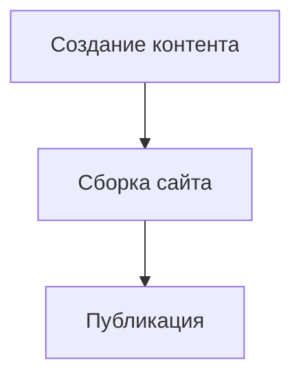

# StaticFlow


StaticFlow - современный генератор статических сайтов с богатой экосистемой для создания контента, написанный на Python.

## 🌟 Особенности

- **Блочный редактор** - создавайте контент визуально без знания Markdown или HTML
- **Встроенная админ-панель** - управляйте контентом через удобный веб-интерфейс
- **Многоязычность** - полная поддержка интернационализации (i18n)
- **Быстрая разработка** - режим горячей перезагрузки (hot reload) для мгновенного просмотра изменений
- **Расширяемость** - система плагинов для добавления любой функциональности
- **SEO-оптимизация** - встроенная поддержка для метаданных, sitemap и генерации данных для поисковиков
- **Современные форматы данных** - поддержка YAML, TOML, JSON для метаданных

## 🚀 Быстрый старт

### Установка

```bash
pip install staticflow
```

### Создание нового проекта

```bash
staticflow create my-awesome-site
cd my-awesome-site
```

### Запуск сервера разработки

```bash
staticflow serve
```

Откройте браузер по адресу `http://localhost:8000` для просмотра сайта и `http://localhost:8000/admin` для доступа к админ-панели.

## 📁 Структура проекта

```
my-awesome-site/
├── content/            # Ваш контент (Markdown, HTML)
├── templates/          # Шаблоны Jinja2
├── static/             # Статические файлы (CSS, JS, изображения)
├── public/             # Сгенерированный сайт
└── config.toml         # Конфигурация проекта
```

## 📝 Создание контента

### Через блочный редактор

1. Откройте админ-панель (`http://localhost:8000/admin`)
2. Перейдите на вкладку "Block Editor"
3. Создавайте контент с помощью различных типов блоков:
   - Форматированный текст
   - Код с подсветкой синтаксиса
   - Математические формулы (LaTeX)
   - Диаграммы (Mermaid)
   - Таблицы
   - Медиа-файлы

### Через Markdown файлы

```markdown
---
title: Мой первый пост
date: 2023-03-23
tags: [tutorial, staticflow]
draft: false
---

# Добро пожаловать

Это мой первый пост с использованием **StaticFlow**.

## Код с подсветкой

```python
def hello_world():
    print("Привет, StaticFlow!")
```

## Диаграммы


```

## 🛠️ Настройка

### Конфигурация (config.toml)

```toml
# Основные настройки
title = "Мой сайт на StaticFlow"
description = "Персональный сайт, созданный с помощью StaticFlow"
base_url = "https://example.com"
language = "ru"

# Настройки сборки
[build]
output_dir = "public"
source_dir = "content"
template_dir = "templates"
static_dir = "static"

# Плагины
[plugins]
enabled = ["seo", "sitemap", "rss", "minifier"]

[plugins.seo]
twitter_card = true
open_graph = true

[plugins.sitemap]
priority = 0.8
changefreq = "weekly"
```

## 🧩 Расширение функциональности

### Создание собственного плагина

```python
from staticflow.plugins.base import Plugin

class CustomPlugin(Plugin):
    """Пример собственного плагина."""
    
    def initialize(self):
        self.engine.hooks.register('pre_render', self.my_pre_render_hook)
        self.engine.hooks.register('post_build', self.my_post_build_hook)
    
    def my_pre_render_hook(self, page):
        """Выполняется перед рендерингом каждой страницы."""
        if 'important' in page.metadata.get('tags', []):
            page.metadata['notice'] = "Это важная страница!"
    
    def my_post_build_hook(self):
        """Выполняется после сборки всего сайта."""
        print("Сайт успешно собран!")
```

### Регистрация плагина

```python
# config.toml
[plugins]
enabled = ["seo", "sitemap", "my_custom_plugin"]

[plugins.my_custom_plugin]
option1 = "value1"
option2 = "value2"
```

```python
# Регистрация в коде
from staticflow.engine import Engine
from my_plugins import CustomPlugin

engine = Engine()
engine.register_plugin(CustomPlugin())
engine.build()
```

## 🏗️ Программный API

StaticFlow предоставляет мощный API для програмного создания и управления сайтами:

```python
from staticflow import Engine, Config, Page
from pathlib import Path

# Создаем конфигурацию
config = Config("config.toml")

# Инициализируем движок
engine = Engine(config)

# Создаем страницу программно
page = Page(
    source_path=Path("programmatic.md"),
    content="# Программно созданная страница\n\nЭта страница создана с помощью Python API.",
    metadata={
        "title": "Программная страница",
        "date": "2023-03-23",
        "tags": ["api", "python"]
    }
)

# Добавляем страницу в движок
engine.site.add_page(page)

# Собираем сайт
engine.build()
```

## 🌐 Интеграции

StaticFlow интегрируется с множеством сервисов:

- **Системы аналитики**: Google Analytics, Yandex Metrika
- **Комментарии**: Disqus, Utterances, Giscus
- **Формы**: Formspree, Netlify Forms
- **CMS для админки**: Headless CMS (через API)
- **CDN и деплой**: Netlify, Vercel, GitHub Pages

## 📊 Продвинутые возможности

### Полнотекстовый поиск

```bash
staticflow plugin install search
```

```html
<!-- В шаблоне -->
<input type="text" id="search-input" placeholder="Поиск по сайту...">
<div id="search-results"></div>

<script src="/static/js/search.js"></script>
```

### Пользовательская тема

```bash
staticflow theme create my-theme
staticflow theme use my-theme
```

### Генерация API

```bash
staticflow api generate
```

Создает JSON API из вашего контента, доступный по `/api/content.json`.

## 📚 Шаблонизация

StaticFlow использует Jinja2 для шаблонов:

```html
<!DOCTYPE html>
<html lang="{{ site.language }}">
<head>
    <meta charset="UTF-8">
    <title>{{ page.title }} - {{ site.title }}</title>
    <meta name="description" content="{{ page.description or site.description }}">
    
    
</head>
<body>
    <header>
        <nav>
            <ul>
                
                <li><a href="{{ item.url }}" class="active">{{ item.title }}</a></li>
                
            </ul>
        </nav>
    </header>
    
    <main>
        
        <article>
            <h1>{{ page.title }}</h1>
            <time datetime="{{ page.date }}">{{ page.date|format_date }}</time>
            
            <div class="content">
                {{ page.content|safe }}
            </div>
            
            
            <div class="tags">
                
                <a href="/tags/{{ tag }}" class="tag">{{ tag }}</a>
                
            </div>
            
        </article>
        
    </main>
    
    <footer>
        <p>&copy; {{ now.year }} {{ site.title }}</p>
    </footer>
</body>
</html>
```

## 🔍 Отладка и анализ

```bash
# Запуск в режиме отладки
staticflow serve --debug

# Анализ производительности
staticflow analyze
```

## 📱 Прогрессивные веб-приложения (PWA)

StaticFlow поддерживает создание PWA через плагин:

```bash
staticflow plugin install pwa
```

```toml
# config.toml
[plugins.pwa]
name = "My PWA"
short_name = "PWA"
theme_color = "#4285f4"
background_color = "#ffffff"
display = "standalone"
```

## 🔒 Безопасность

- Автоматическая генерация CSP (Content Security Policy)
- Защита от XSS-атак
- Оптимизация заголовков безопасности
- Безопасное хранение GitHub токенов с шифрованием
- Поддержка переменных окружения для токенов (`GITHUB_TOKEN` или `STATICFLOW_GITHUB_TOKEN`)
- Проверка срока действия токенов и предупреждения об истечении
- Возможность указания пользовательских коммит-сообщений при деплое

## 🌎 Многоязычность

```toml
# config.toml
[i18n]
default_language = "ru"
languages = ["ru", "en", "fr"]
```

```
content/
├── en/
│   ├── about.md
│   └── index.md
├── fr/
│   ├── about.md
│   └── index.md
└── ru/
    ├── about.md
    └── index.md
```

## 🚀 Развертывание

StaticFlow поддерживает автоматическое развертывание на различных платформах:

### GitHub Pages

```bash
# Настройка через CLI
staticflow deploy setup github-pages

# Запуск деплоя
staticflow deploy github-pages
```

Или используйте встроенную админ-панель для настройки и деплоя (доступна по адресу `/admin/deploy`).

**Безопасное хранение GitHub токенов:**

StaticFlow обеспечивает безопасное хранение GitHub токенов:
- Токены шифруются перед сохранением в конфигурационный файл
- Поддержка переменных окружения (`GITHUB_TOKEN`, `STATICFLOW_GITHUB_TOKEN`)
- Проверка срока действия токенов и предупреждения
- Возможность указания пользовательских коммит-сообщений при деплое

**Необходимая информация для деплоя:**
- URL репозитория (обязательно)
- Имя пользователя GitHub (обязательно)
- Git Email (обязательно)
- GitHub Token (рекомендуется)
- Ветка для деплоя (по умолчанию: gh-pages)
- CNAME для кастомного домена (опционально)

## 🤝 Сообщество и вклад

StaticFlow — проект с открытым исходным кодом. Мы приветствуем вклад сообщества!

- GitHub: 
- Документация: [docs.staticflow.dev]
- Форум: [community.staticflow.dev]
## 📄 Лицензия

MIT

---

Создано с 💙 разработчиком StaticFlow @nestessia
