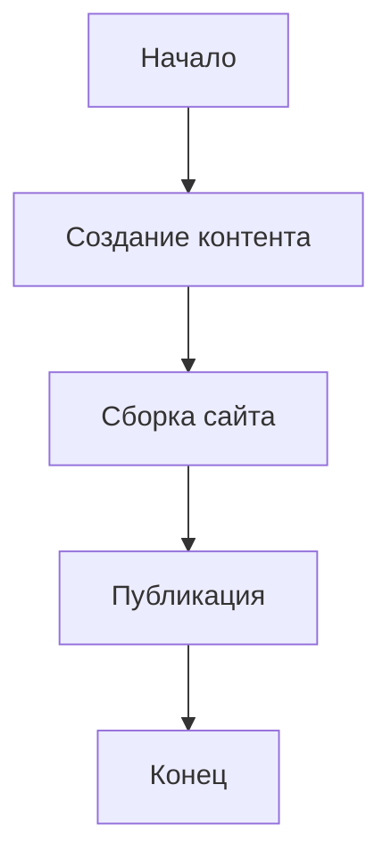

# Добро пожаловать в StaticFlow!

StaticFlow - это современный генератор статических сайтов с богатыми возможностями для создания контента.

## Возможности

### 1. Подсветка кода

```python
def hello_world():
    print("Привет, StaticFlow!")
```

### 2. Математические формулы

Inline формула: $E = mc^2$

Блочная формула:
$$
\int_0^\infty e^{-x} dx = 1
$$

### 3. Диаграммы



### 4. Блоки в стиле Notion

:::info Информация
Это информационный блок. Используйте его для важных заметок.
:::

:::warning Предупреждение
Это блок с предупреждением. Обратите особое внимание!
:::

### 5. Раскрывающиеся блоки

>>> Нажмите, чтобы увидеть больше
Здесь может быть скрыт дополнительный контент.
Например, подробные инструкции или примечания.
<<<

### 6. Списки задач

- [ ] Изучить StaticFlow
- [x] Создать первый проект
- [ ] Настроить плагины
- [ ] Опубликовать сайт

### 7. Таблицы

||Функция|Описание|Статус
Markdown|Базовая разметка|✅
Подсветка кода|Поддержка множества языков|✅
Математика|KaTeX для формул|✅
Диаграммы|Mermaid для схем|✅||

## Начало работы

1. Установка:
```bash
pip install staticflow
```

2. Создание проекта:
```bash
staticflow create myproject
cd myproject
```

3. Запуск сервера разработки:
```bash
staticflow serve
```

## Документация

>>> Структура проекта
```
myproject/
├── content/
│   └── pages/
│       ├── index.md
│       └── about.md
├── templates/
│   └── base.html
├── static/
│   └── css/
│       └── style.css
├── public/
└── config.toml
```
<<< 