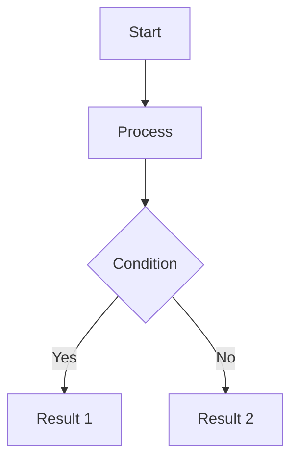

# Quick Start with StaticFlow

This guide will help you quickly get started with StaticFlow. We'll create a simple blog site with basic functionality.

## Creating a project

1. Create a new project:

```bash
staticflow create my-blog
cd my-blog
```

2. To build the application, run:

```bash
staticflow build
```

3. To start the development server, run:

```bash
staticflow serve
```

## Project structure

After creating a project, you'll have the following structure:

```
my-blog/
├── content/          # Site content
│   └── index.md     # Home page
├── templates/        # Templates
│   ├── base.html    # Base template
│   └── page.html    # Page template
├── static/          # Static files
│   ├── css/        # Styles
│   └── js/         # Scripts
├── output/          # Built site
│   ├── ...        # Site build
└── config.toml      # Configuration
```

## Creating your first page

1. Open `content/index.md` and edit it:

```markdown
---
title: My Blog
date: 2025-03-20
author: your name
tags: [blog, welcome]
format: markdown
template: page.html
---

# Welcome to my blog!

This is my first page created with StaticFlow.
```

## Template configuration

1. You can change templates and inherit from them. Base templates are located in the `templates/` folder. Create your own template in `templates/` and specify it in the front matter.

```html
    

    {{ page.title or "Untitled" }}

    {{ page_head_content|safe }}

    
        {{ page_content|safe }}
     
```

```markdown
---
title: My Blog
date: 2025-03-20
author: your name
tags: [blog, welcome]
format: markdown
template: blog.html # Change to your template
---
```

## Adding styles

1. Create a file `static/css/style.css`:

```css
body {
    font-family: Arial, sans-serif;
    line-height: 1.6;
    margin: 0;
    padding: 20px;
}

header {
    margin-bottom: 20px;
}

nav a {
    margin-right: 10px;
}
```

And connect it to the template:

```html
<link rel="stylesheet" href="{{ static_dir }}/css/style.css">
```

## Admin panel
StaticFlow provides an admin panel for content management. To use it, start the development server and go to `http://localhost:8000/admin/`. You'll see all your site content:


You can then edit content or create new pages in the admin panel by clicking "Edit" or "Create new page" respectively.

For more information about the admin panel, see the [Admin Panel](admin.html) section.

# Working with content

This section covers how to create and manage content in StaticFlow.

## Content formats

StaticFlow supports several content formats:

- Markdown (`.md`)
- HTML (`.html`)

## Content file structure

Each content file consists of two parts:

1. **Front Matter** - metadata in YAML format
2. **Content** - main content in the chosen format

## Metadata (Front Matter)

### Required fields
- `format` - content format
- `template` - template to use

### Optional fields
- `date` - creation/publication date
- `title` - page title
- `author` - content author
- `tags` - list of tags
- `category` - category
- `description` - page description
- `slug` - URL-friendly version of title

## Content organization

### Categories

Categories allow you to organize content hierarchically:

```
content/
├── blog/
│   ├── index.md
│   ├── post-1.md
│   └── post-2.md
├── projects/
│   ├── index.md
│   └── project-1.md
└── about.md
```

### Tags

Tags help group content by topics:

```markdown
---
tags: [python, web, tutorial]
---
```

## Working with media files

### Images

1. Place images in the `media/` directory
2. Use in content:

```markdown

```

## Advanced content

### Mathematical formulas

```markdown
Inline formula: $E = mc^2$

Block formula:
$$
\int_0^\infty e^{-x} dx = 1
$$
```

### Diagrams

```markdown

``` 