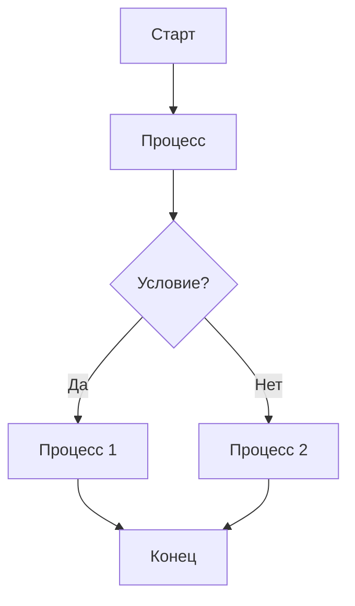
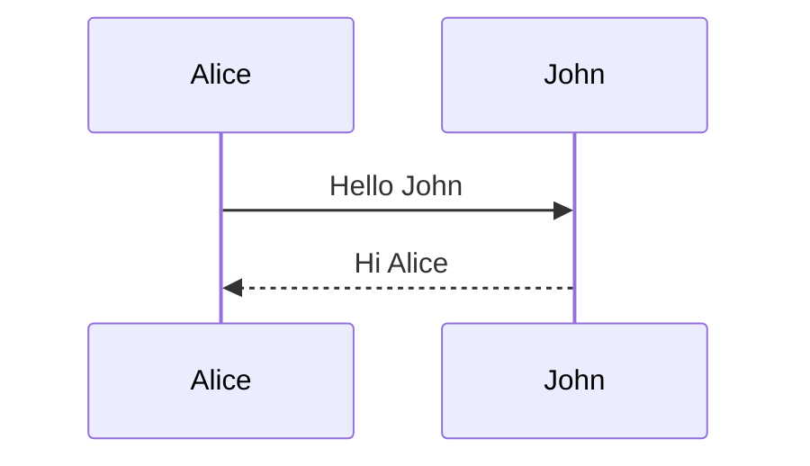
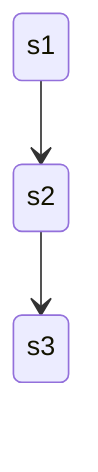
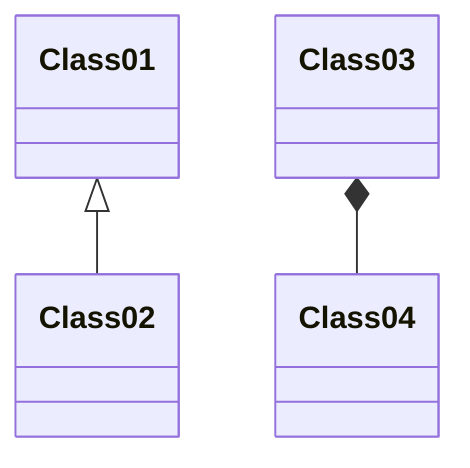

# Добро пожаловать в StaticFlow!


StaticFlow - это современный фреймворк для генерации статических сайтов с гибким функционалом для создания конента.


## Возможности


### 1. Подсветка кода


```python
def hello_world():
    print("Привет, StaticFlow!")
    
    if True:
        print("Tabs are working!")
        for i in range(3):
            print(f"Tab level {i+1}")
```


Here's some JavaScript with tabs:


```javascript
function testFunction() {
    console.log("Testing tabs");
    
    if (true) {
        console.log("Nested level");
        
        for (let i = 0; i < 3; i++) {
            console.log(`Loop iteration ${i}`);
        }
    }
}
```


### 2. Математические формулы


Inline формула: $E = mc^2$


Блочная формула: $ \int_0^\infty e^{-x} dx = 1 $


### 3. Диаграммы


#### Блок-схема





#### Диаграмма последовательности





#### Диаграмма состояний





#### Диаграмма классов





## Начало работы


Создание контента:


Добавьте Markdown файлы в директорию content


Используйте front matter для метаданных


Настройка шаблонов:


Измените шаблоны в директории templates


Добавьте свои стили в static/css


Запуск сервера разработки:


```bash
staticflow serve
```