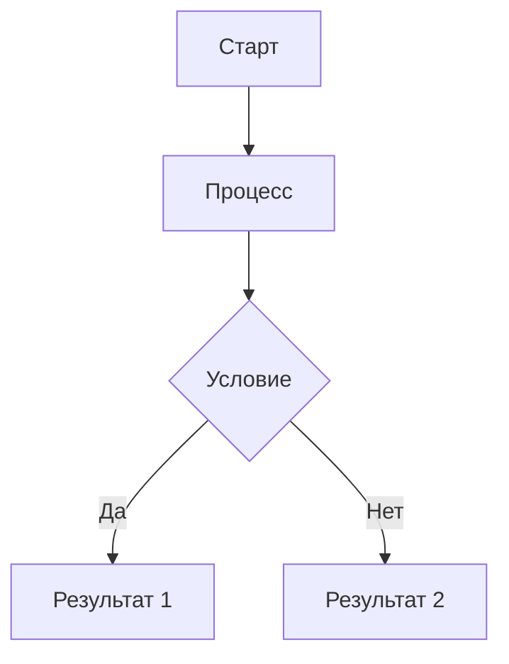

# Быстрый старт с StaticFlow

Это руководство поможет вам быстро начать работу с StaticFlow. Мы создадим простой сайт-блог с основными функциями.

## Создание проекта

1. Создайте новый проект:

```bash
staticflow create my-blog
cd my-blog
```

2. Запустите сервер разработки:

```bash
staticflow serve
```

## Структура проекта

После создания проекта у вас будет следующая структура:

```
my-blog/
├── content/          # Контент сайта
│   └── index.md     # Главная страница
├── templates/        # Шаблоны
│   ├── base.html    # Базовый шаблон
│   └── page.html    # Шаблон страницы
├── static/          # Статические файлы
│   ├── css/        # Стили
│   └── js/         # Скрипты
└── config.toml      # Конфигурация
```

## Создание первой страницы

1. Откройте `content/index.md` и отредактируйте его:

```markdown
---
title: Мой блог
date: 2024-03-20
author: nastya
tags: [blog, welcome]
format: markdown
template: page.html
---

# Добро пожаловать в мой блог!

Это моя первая страница, созданная с помощью StaticFlow.
```

## Добавление поста

1. Создайте новый файл `content/posts/my-first-post.md`:

```markdown
---
title: Мой первый пост
date: 2024-03-20
author: nastya
tags: [blog, first-post]
format: markdown
template: post.html
---

# Мой первый пост

Это мой первый пост в блоге. Здесь я буду делиться своими мыслями и идеями.
```

## Настройка шаблона

1. Откройте `templates/base.html`:

```html
<!DOCTYPE html>
<html>
<head>
    <title>{{ page.title }} - {{ config.site_name }}</title>
    <link rel="stylesheet" href="/static/css/style.css">
</head>
<body>
    <header>
        <nav>
            <a href="/">Главная</a>
            <a href="/posts">Посты</a>
        </nav>
    </header>
    
    <main>
        
    </main>
    
    <footer>
        <p>&copy; {{ config.site_name }} {{ now.year }}</p>
    </footer>
</body>
</html>
```

## Добавление стилей

1. Создайте файл `static/css/style.css`:

```css
body {
    font-family: Arial, sans-serif;
    line-height: 1.6;
    margin: 0;
    padding: 20px;
}

header {
    margin-bottom: 20px;
}

nav a {
    margin-right: 10px;
}
```

## Сборка сайта

Для сборки сайта выполните:

```bash
staticflow build
```

Собранный сайт будет находиться в директории `output/`.

## Следующие шаги

Теперь, когда у вас есть базовый сайт, вы можете:

1. Добавить больше страниц и постов
2. Настроить категории и теги
3. Добавить пользовательские шаблоны
4. Интегрировать плагины
5. Настроить поиск
6. Добавить комментарии


# Работа с контентом

В этом разделе мы рассмотрим, как создавать и управлять контентом в StaticFlow.

## Форматы контента

StaticFlow поддерживает несколько форматов контента:

- Markdown (`.md`)
- HTML (`.html`)
- reStructuredText (`.rst`)
- Textile (`.textile`)

## Структура файлов контента

Каждый файл контента состоит из двух частей:

1. **Front Matter** - метаданные в формате YAML
2. **Содержимое** - основной контент в выбранном формате

### Пример файла

```markdown
---
title: Заголовок страницы
date: 2024-03-20
author: nastya
tags: [tag1, tag2]
category: blog
format: markdown
template: page.html
---

# Основной контент

Здесь идет содержимое страницы...
```

## Метаданные (Front Matter)

### Обязательные поля

- `title` - заголовок страницы
- `date` - дата создания/публикации
- `format` - формат контента

### Опциональные поля

- `author` - автор контента
- `tags` - список тегов
- `category` - категория
- `template` - используемый шаблон
- `draft` - черновик (true/false)
- `description` - описание страницы
- `image` - главное изображение
- `slug` - URL-friendly версия заголовка

## Организация контента

### Категории

Категории позволяют организовать контент иерархически:

```
content/
├── blog/
│   ├── index.md
│   ├── post-1.md
│   └── post-2.md
├── projects/
│   ├── index.md
│   └── project-1.md
└── about.md
```

### Теги

Теги помогают группировать контент по темам:

```markdown
---
tags: [python, web, tutorial]
---
```

## Специальные страницы

### Главная страница

Файл `content/index.md` используется как главная страница сайта.

### Страницы категорий

Создайте `index.md` в директории категории для создания страницы категории:

```markdown
---
title: Блог
template: category.html
---
```

### Страницы тегов

Теги автоматически генерируют страницы при использовании.

## Работа с медиафайлами

### Изображения

1. Поместите изображения в директорию `media/`
2. Используйте в контенте:

```markdown

```

### Другие медиафайлы

- Видео
- Аудио
- PDF документы
- Другие файлы

## Шаблоны контента

### Страницы

```markdown
---
template: page.html
---
```

### Посты

```markdown
---
template: post.html
---
```

### Пользовательские шаблоны

Создайте свой шаблон в `templates/` и укажите его в front matter.

## Расширенный контент

### Математические формулы

```markdown
Inline формула: $E = mc^2$

Блочная формула:
$$
\int_0^\infty e^{-x} dx = 1
$$
```

### Диаграммы

```markdown

```

### Подсветка кода

```markdown
```python
def hello_world():
    print("Привет, StaticFlow!")
```
```

## Локализация

### Многоязычный контент

```markdown
---
language: ru
---

# Русский контент
```

```markdown
---
language: en
---

# English content
```

## Плагины для контента

- `staticflow-markdown` - расширенная поддержка Markdown
- `staticflow-images` - оптимизация изображений
- `staticflow-search` - поиск по контенту
- `staticflow-comments` - система комментариев 