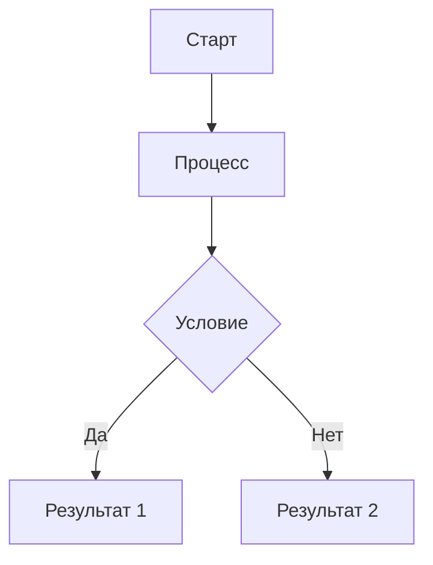

# 🚀 Быстрый старт с StaticFlow

Это руководство поможет вам быстро начать работу с StaticFlow. Мы создадим простой сайт-блог с основными функциями.

## 🏗️ Создание проекта

1. Создайте новый проект:

```bash
staticflow create my-blog
cd my-blog
```

2. Чтобы сбилдить приложение, выполните команду:

```bash
staticflow build
```

3. Чтобы запустить сервер разработки, выполните команду:

```bash
staticflow serve
```

## 📁 Структура проекта

После создания проекта у вас будет следующая структура:

```
my-blog/
├── content/          # Контент сайта
│   └── index.md     # Главная страница
├── templates/        # Шаблоны
│   ├── base.html    # Базовый шаблон
│   └── page.html    # Шаблон страницы
├── static/          # Статические файлы
│   ├── css/        # Стили
│   └── js/         # Скрипты
├── output/          # Собранный сайт
│   ├── ...        # Сборка сайта
└── config.toml      # Конфигурация
```

## ✍️ Создание первой страницы

1. Откройте `content/index.md` и отредактируйте его:

```markdown
---
title: Мой блог
date: 2025-03-20
author: you name
tags: [blog, welcome]
format: markdown
template: page.html
---

# Добро пожаловать в мой блог!

Это моя первая страница, созданная с помощью StaticFlow.
```


## 🎨 Настройка шаблона

1. Вы можете менять шаблоны и наследоваться от них. Базовые шаблоны расположены в папке `templates/`. Создайте свой шаблон в `templates/` и укажите его в front matter.

```html
    

    {{ page.title or "Untitled" }}

    {{ page_head_content|safe }}

    
        {{ page_content|safe }}
     
```

```markdown
---
title: Мой блог
date: 2025-03-20
author: you name
tags: [blog, welcome]
format: markdown
template: blog.html # Измените на ваш шаблон
---
```

## 🎨 Добавление стилей

1. Создайте файл `static/css/style.css`:

```css
body {
    font-family: Arial, sans-serif;
    line-height: 1.6;
    margin: 0;
    padding: 20px;
}

header {
    margin-bottom: 20px;
}

nav a {
    margin-right: 10px;
}
```

И подключите его к шаблону:

```html
<link rel="stylesheet" href="{{ static_dir }}/css/style.css">
```

## ⚙️ Панель администратора
StaticFlow предоставляет панель администратора для управления контентом. Чтобы ее использовать, запустите сервер разработки и перейдите по адресу `http://localhost:8000/admin/`. Вы увидите весь контент вашего сайта:


Далее вы можете изменять контент или создавать новые страницы в панели администратора нажав на кнопку "Edit" или "Create new page" соответственно.

Подробнее о панели администратора вы можете узнать в разделе [Панель администратора](admin.html).


# 📝 Работа с контентом

В этом разделе мы рассмотрим, как создавать и управлять контентом в StaticFlow.

## 📄 Форматы контента

StaticFlow поддерживает несколько форматов контента:

- 📝 Markdown (`.md`)
- 🌐 HTML (`.html`)

## 📋 Структура файлов контента

Каждый файл контента состоит из двух частей:

1. **Front Matter** - метаданные в формате YAML
2. **Содержимое** - основной контент в выбранном формате


## 🏷️ Метаданные (Front Matter)

### Обязательные поля
- `format` - формат контента
- `template` - используемый шаблон

### Опциональные поля
- `date` - дата создания/публикации
- `title` - заголовок страницы
- `author` - автор контента
- `tags` - список тегов
- `category` - категория
- `description` - описание страницы
- `slug` - URL-friendly версия заголовка

## 📂 Организация контента

### 📁 Категории

Категории позволяют организовать контент иерархически:

```
content/
├── blog/
│   ├── index.md
│   ├── post-1.md
│   └── post-2.md
├── projects/
│   ├── index.md
│   └── project-1.md
└── about.md
```

### 🏷️ Теги

Теги помогают группировать контент по темам:

```markdown
---
tags: [python, web, tutorial]
---
```

## 🖼️ Работа с медиафайлами

### 🖼️ Изображения

1. Поместите изображения в директорию `media/`
2. Используйте в контенте:

```markdown

```


## 🔬 Расширенный контент

### 📐 Математические формулы

```markdown
Inline формула: $E = mc^2$

Блочная формула:
$$
\int_0^\infty e^{-x} dx = 1
$$
```

### 📊 Диаграммы

```markdown

```
