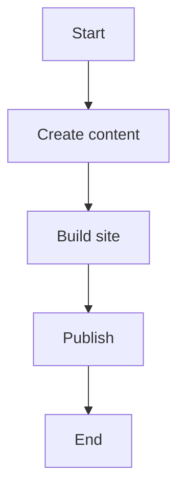

# Welcome to StaticFlow!

StaticFlow is a modern static site generator with rich content creation capabilities.

## Features

### 1. Syntax Highlighting

```python
def hello_world():
    print("Hello, StaticFlow!")
```

### 2. Math Formulas

Inline formula: $E = mc^2$

Block formula:
$
\\int_0^\\infty e^{-x} dx = 1
$

### 3. Diagrams



### 4. Notion-style Blocks

:::info Information
This is an information block. Use it for important notes.
:::

:::warning Warning
This is a warning block. Pay special attention!
:::

## Getting Started

1. Create content:
   - Add Markdown files to the `content` directory
   - Use front matter for metadata

2. Customize templates:
   - Edit templates in the `templates` directory
   - Add your styles in `static/css`

3. Start the development server:
```bash
staticflow serve
``` 