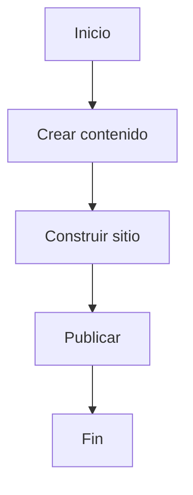

# ¡Bienvenido a StaticFlow!

StaticFlow es un generador de sitios estáticos moderno con amplias capacidades para la creación de contenido.

## Características

### 1. Resaltado de Sintaxis

```python
def hello_world():
    print("¡Hola, StaticFlow!")
```

### 2. Fórmulas Matemáticas

Fórmula en línea: $E = mc^2$

Fórmula en bloque:
$
\\int_0^\\infty e^{-x} dx = 1
$

### 3. Diagramas



### 4. Bloques estilo Notion

:::info Información
Este es un bloque de información. Úsalo para notas importantes.
:::

:::warning Advertencia
Este es un bloque de advertencia. ¡Presta especial atención!
:::

## Primeros Pasos

1. Crear contenido:
   - Añade archivos Markdown en el directorio `content`
   - Usa front matter para los metadatos

2. Personalizar plantillas:
   - Edita las plantillas en el directorio `templates`
   - Añade tus estilos en `static/css`

3. Inicia el servidor de desarrollo:
```bash
staticflow serve
``` 