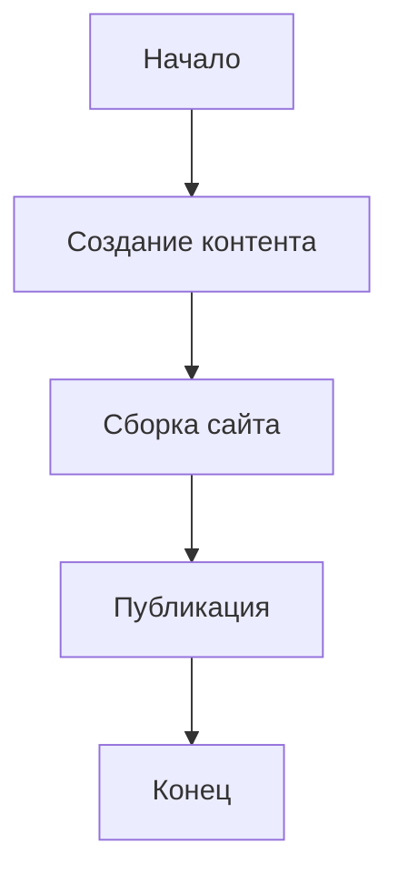

# Добро пожаловать в StaticFlow!

StaticFlow - это современный генератор статических сайтов с богатыми возможностями для создания контента.

## Возможности

### 1. Подсветка кода

```python
def hello_world():
    print("Привет, StaticFlow!")
```

### 2. Математические формулы

Inline формула: $E = mc^2$

Блочная формула:
$
\int_0^\infty e^{-x} dx = 1
$

### 3. Диаграммы



### 4. Блоки в стиле Notion

:::info Информация
Это информационный блок. Используйте его для важных заметок.
:::

:::warning Предупреждение
Это блок с предупреждением. Обратите особое внимание!
:::

## Начало работы

1. Создание контента:
   - Добавьте Markdown файлы в директорию `content`
   - Используйте front matter для метаданных

2. Настройка шаблонов:
   - Измените шаблоны в директории `templates`
   - Добавьте свои стили в `static/css`

3. Запуск сервера разработки:
```bash
staticflow serve
```