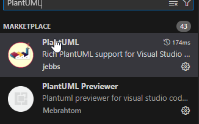
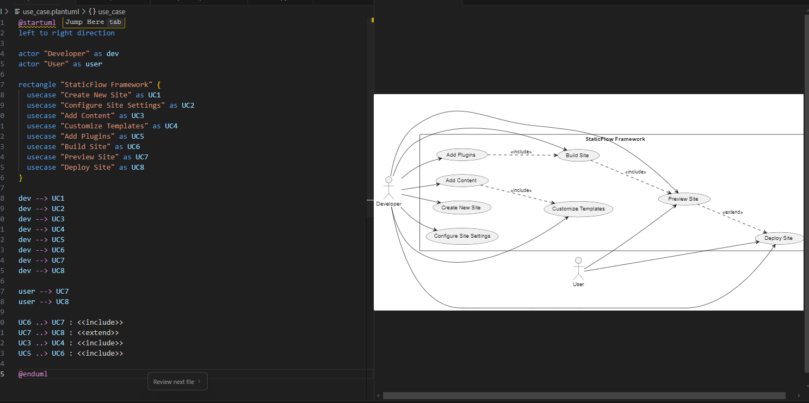

# Описание UML диаграмм StaticFlow Framework

## 1. Диаграмма классов

Диаграмма классов представляет собой статическую структуру фреймворка StaticFlow. Основные компоненты:

- **Engine** - центральный класс, управляющий процессом сборки сайта. Координирует работу всех остальных компонентов.
- **Site** - класс, представляющий сайт в целом. Управляет директориями и конфигурацией.
- **Page** - класс для работы с отдельными страницами. Отвечает за рендеринг контента.
- **Config** - класс для управления конфигурацией фреймворка.
- **Plugin** - абстрактный класс для создания плагинов, расширяющих функциональность.
- **Cache** - класс для кэширования результатов обработки страниц.

## 2. Диаграмма последовательности

Диаграмма последовательности показывает динамику взаимодействия компонентов при сборке сайта:

1. Разработчик инициализирует движок и указывает директории
2. Добавляются плагины и происходит их инициализация
3. Запускается процесс сборки:
   - Получение списка страниц
   - Обработка каждой страницы с проверкой кэша
   - Применение плагинов к страницам
   - Копирование статических файлов

## 3. Диаграмма состояний

Диаграмма состояний описывает жизненный цикл процесса сборки сайта:

1. **Initialized** - начальное состояние после создания движка
2. **Configured** - после инициализации конфигурации
3. **Ready** - после добавления плагинов
4. **Building** - процесс сборки, включающий:
   - Processing - обработка страниц
   - Rendering - рендеринг контента
   - Caching - кэширование результатов
   - Copying - копирование статических файлов
5. **Ready** - завершение сборки
6. **Clean** - очистка временных файлов

## 4. Диаграмма деятельности

Диаграмма деятельности детально описывает алгоритм работы фреймворка:

1. Инициализация фреймворка и загрузка конфигурации
2. Установка рабочих директорий
3. Инициализация плагинов
4. Цикл обработки страниц:
   - Проверка кэша
   - Парсинг контента
   - Обработка метаданных
   - Применение шаблонов
   - Кэширование результатов
5. Копирование статических файлов
6. Генерация карты сайта

## 5. Диаграмма вариантов использования

Диаграмма вариантов использования описывает взаимодействие пользователей с фреймворком:

### Основные актёры:
- **Developer** - разработчик, использующий фреймворк для создания сайтов
- **User** - конечный пользователь, просматривающий и использующий готовый сайт

### Варианты использования:
1. **Create New Site** - создание нового сайта
2. **Configure Site Settings** - настройка параметров сайта
3. **Add Content** - добавление контента
4. **Customize Templates** - настройка шаблонов
5. **Add Plugins** - добавление плагинов
6. **Build Site** - сборка сайта
7. **Preview Site** - предпросмотр сайта
8. **Deploy Site** - развертывание сайта

## Подход к выполнению задания

При создании UML диаграмм был использован следующий подход:

1. **Анализ предметной области**:
   - Изучение существующих фреймворков для генерации статических сайтов
   - Выделение ключевых компонентов и их взаимодействия
   - Определение основных процессов и состояний

2. **Создание диаграмм**:
   - Использование PlantUML для создания диаграмм
   - Постепенное уточнение и детализация каждой диаграммы
   - Проверка согласованности между диаграммами

3. **Генерация кода**:
   - Создание базовой структуры классов на основе диаграммы классов
   - Реализация основных методов и интерфейсов
   - Добавление типизации и документации

4. **Валидация**:
   - Проверка корректности диаграмм
   - Тестирование сгенерированного кода
   - Убеждение в полноте покрытия функциональности 

Расширение:

Демонстрация генерации диаграммы (alt + D):

